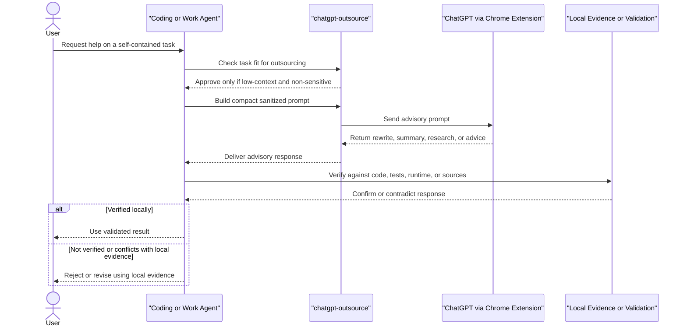

# chatgpt-outsource

Use ChatGPT as a bounded external advisor for safe, self-contained tasks such as rewriting, translation, summarization, research, and debugging advice, so coding or work agents can save tokens for local reasoning, execution, and verification while keeping local validation as the final authority.

## Files

- `SKILL.md`: the skill definition and operating rules
- `agents/openai.yaml`: the OpenAI agent interface metadata

## Scope

- Good fit for low-context, non-sensitive tasks that can be expressed in a compact prompt
- Useful when you want coding or work agents to preserve context and token budget for repository-specific reasoning and execution
- Designed for advisory use, not direct local file editing or final factual authority
- Emphasizes prompt sanitization, response validation, and preference for local evidence on conflict

## Sequence Diagram

## Notes

- This repo was initialized from the installed local skill at `~/.codex/skills/chatgpt-outsource`.
- The current content is suitable for local iteration before any public GitHub cleanup.
